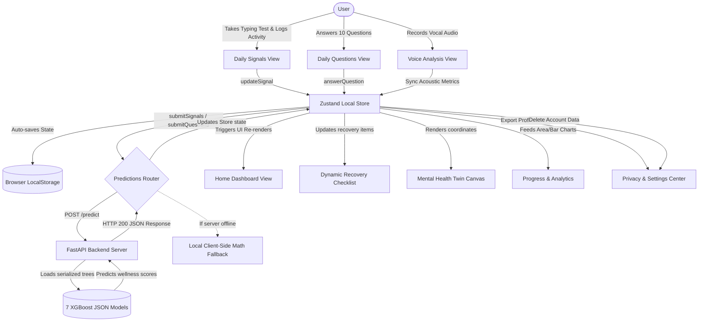

# SentienceX — Mental Wellness Operating System MVP

> **"The Intelligence That Feels What Others Cannot."**

SentienceX is a premium, AI-first Mental Wellness Operating System dashboard built to passively and actively monitor cognitive load, stress, and behavioral telemetry. Backed by **7 trained XGBoost ML regressors** (trained on **50,000 samples** of realistic behavior), it maps your digital **Mental Health Twin** and generates explainable, rule-based recovery recommendations. The system is designed to remain fully compliant with India's **Digital Personal Data Protection (DPDP) Act, 2023**.

---

## 🗺️ System Architecture & Data Flow

SentienceX is architected as a hybrid AI system. It leverages a Next.js (TypeScript) frontend for user interaction, local state management, and real-time canvas visualizations, combined with a FastAPI (Python) backend to run low-latency XGBoost regression models.

### Data Flow Diagram



### State Management (`src/store/useWellnessStore.ts`)
The application's core state is managed by a **Zustand store** that handles data binding, API transactions, and local browser persistence. 
- **State Properties**:
  - `user`: Holds name, email, and cryptographic session tokens.
  - `signals`: Tracks real-time active indicators (typing speed, accuracy, latency, errors) and physical logs (sleep duration, sleep quality, steps, screen time, social minutes, social quality).
  - `questions`: Holds the answers (1-5 Likert scale) for the 10 daily mental health assessment questions.
  - `predictions`: Stores current prediction ratings (stress, burnout, anxiety, motivation, loneliness, cognitive fatigue, and overall wellness).
  - `tasks`: A dynamic checklist of wellness tasks.
  - `chatMessages`: Chronological chat log with the virtual counselor.
  - `consentTelemetry` & `consentSharing`: DPDP-compliant telemetry flags.
- **Dynamic Rules Engine**: When predictions are updated, the store automatically recalculates and overrides the daily recovery `tasks` checklist based on the user's `overall_wellness` index:
  - **Crisis (Score < 50)**: Focuses on clinical assistance, national helpline referrals (NIMHANS, iCall), emergency contact notification, and grounding exercises.
  - **Moderate Risk (Score 50 - 70)**: Suggests CBT thought records, blue-light digital detoxes, deep hydration, and light stretching.
  - **Stable / Healthy (Score > 70)**: Focuses on breathing walking, outdoor walks, ambient music therapy, and social check-ins.

---

## 🧠 Machine Learning & Data Pipeline

SentienceX uses real-world-grade machine learning models to prevent arbitrary state transitions. It has a fully defined training pipeline from data generation to model serving.

### 1. Realistic Dataset Generator (`scripts/generate_dataset.py`)
To mimic a real-world clinical dataset, the script generates **50,000 daily user logs** incorporating several human behavior characteristics:
* **User Personas**: Synthesizes data representing six specific archetypes:
  - *Corporate Workaholic (20%)*: High screen time, low sleep duration, high typing speed, high typing errors.
  - *Active & Balanced (20%)*: High steps (10k-22k), low screen time, high sleep quality, low stress.
  - *Social Extrovert (15%)*: High social minutes, high social quality, low loneliness.
  - *Night Owl / Gamer (15%)*: High screen time, extremely low sleep, late-night high typing latency.
  - *Sedentary / Depressed (10%)*: Very low steps, low sleep quality, high loneliness, slow typing.
  - *Average User (20%)*: Baseline normal distributions.
* **Temporal Patterns (Weekend Effect)**: Applies adjustments for weekend days (higher sleep duration, lower screen time for workaholics, lower professional typing speed, higher self-reported affect).
* **Multi-variable Dependencies**:
  - Sleep deprivation (< 6 hrs) increases typing latency and doubles typing errors.
  - Excessive screen time (> 8 hrs) degrades sleep quality.
  - Higher typing speed introduces accuracy penalties (speed-accuracy tradeoff).
* **Compounding Non-Linear Target Interactions**:
  - *Stress*: Base factors + `12%` penalty when high screen time and low sleep duration compound.
  - *Burnout*: Base factors + `15%` penalty if high stress coincides with poor sleep quality.
  - *Anxiety*: Base factors + `15%` penalty when sleep deprivation compounds with social isolation.
  - *Motivation*: Synergistically boosted by `10%` if steps are high AND sleep quality is excellent.
  - *Loneliness*: Base factors + `18%` penalty if social minutes AND social quality are low.
  - *Cognitive Fatigue*: Base factors + `15%` penalty when low sleep duration compounds with high screen time.

### 2. XGBoost Trainer (`scripts/train_model.py`)
Fits **7 individual XGBoost Regressors** (Gradient Boosting Trees) using the 50,000-row dataset:
* **Features Used (11 Inputs)**: `typing_speed`, `typing_accuracy`, `typing_latency`, `typing_errors`, `sleep_duration`, `sleep_quality`, `steps`, `screen_time`, `social_minutes`, `social_quality`, `question_affect`.
* **Targets (7 Outputs)**: `stress`, `burnout`, `anxiety`, `motivation`, `loneliness`, `cognitive_fatigue`, `overall_wellness`.
* **Hyperparameters**: `n_estimators=300`, `max_depth=6`, `learning_rate=0.03`, `subsample=0.8`, `colsample_bytree=0.8`.
* **Performance Metrics (80/20 Split)**:
  - **Overall Wellness**: $R^2 = 97.0\%$ (MAE: 2.33, RMSE: 2.92)
  - **Motivation**: $R^2 = 95.9\%$ (MAE: 3.18, RMSE: 4.01)
  - **Loneliness**: $R^2 = 95.8\%$ (MAE: 3.12, RMSE: 3.97)
  - **Stress Severity**: $R^2 = 94.9\%$ (MAE: 3.29, RMSE: 4.12)
  - **Burnout Risk**: $R^2 = 94.2\%$ (MAE: 3.70, RMSE: 4.77)
  - **Cognitive Fatigue**: $R^2 = 91.5\%$ (MAE: 3.27, RMSE: 4.12)
  - **Anxiety Level**: $R^2 = 90.6\%$ (MAE: 4.27, RMSE: 5.34)

### 3. Inference Server (`scripts/server.py`)
A FastAPI backend server that loads the serialized JSON tree files on startup and exposes:
- `GET /`: Health check.
- `GET /model_metadata`: Dynamically exposes the active `model_metadata.json` coefficient trees to client-side runtimes.
- `POST /predict`: Takes JSON inputs matching the `TelemetryInput` schema, runs inference across all 7 XGBoost models, and returns rounded predictions.
- `POST /data/clinical_log`: Persists weekly PHQ-9 (depression) and GAD-7 (anxiety) questionnaire answers, total scores, and the ML models' active predictions to the `phq9_gad7_logs` database table for calibration audits.

### 4. Client-side Fallback & Model Drift Sync (`src/utils/predictions.ts`)
To maintain frontend functionality when the Python API server is offline, the client falls back to a mathematical approximation. This model mirrors the trained XGBoost correlations using normalized weighted linear equations:
- **Runtime Metadata Loading**: Fetches fresh model coefficients from `GET /model_metadata` and caches them in local storage. This guarantees the local fallback logic never silently drifts out of sync with the main trained XGBoost models.
- **Offline Reliability**: Normalizes signals to a $0 - 100$ scale and computes indices locally, ensuring predictions remain available in offline or zero-network conditions.

---

## 🇮🇳 DPDP Act, 2023 Compliance & Privacy Shield

SentienceX integrates native data protection and user safety guards directly in the client layout, satisfying the key requirements of India's Digital Personal Data Protection (DPDP) Act, 2023:
1. **Right to Access & Portability**: Under **Settings**, users can download their complete telemetry profile as a formatted `.json` file or export their chronological 30-day log history as a `.csv` file.
2. **Right to Erasure (Right to be Forgotten)**: A double-confirmation "Erase Account Data" trigger permanently wipes all session data, settings, message logs, and telemetry variables from browser memory.
3. **Purpose Limitation Consent**: Interactive toggles allow users to easily opt-in or opt-out of telemetry tracking, anonymous research sharing, and vocal biometrics.
4. **Vocal Biometrics Consent Gate**: Access to the Voice Analysis tab is strictly gated by a consent setting. When disabled, microphone streams are blocked. When enabled, raw voice buffers are processed transiently in the browser and instantly garbage-collected, and a `Beta — Simulated Biometrics` badge is shown.
5. **Clinically Safe Self-Report Wizard**: A 7-day optional "Deeper Check-in" modal records weekly clinical validation scores. The results screen translates scores to standard severity classifications and displays reassuring diagnostic disclaimers to prevent user anxiety.
6. **Centralized Multi-Environment Support**: Configuration parameters are decoupled via the `NEXT_PUBLIC_API_URL` environment variable for secure, robust multi-host deployment.
7. **Cryptographic Privacy (`src/utils/cryptography.ts`)**: Password inputs during signup/login are hashed using **SHA-256** via the native Web Crypto API (`window.crypto.subtle`) on the client side, ensuring plaintext credentials are never cached, stored, or leaked.

---

## 📂 Detailed Folder & File Walkthrough

### `/scripts` (Python Machine Learning Pipeline)
* `generate_dataset.py`: Generates the 50,000-row synthetic wellness dataset and saves it to `data/wellness_dataset.csv`.
* `train_model.py`: Splitting, model training, metric evaluation, exporting models, and drafting the `MODEL_CARD.md`.
* `server.py`: FastAPI server that serves live predictions on port 8000.
* `requirements.txt`: Python package list (numpy, pandas, xgboost, scikit-learn, fastapi, uvicorn, joblib, pydantic).

### `/model_artifacts` (Serialized Models & Model Card)
* `*_model.json`: Individual serialized trees (JSON format) for stress, burnout, anxiety, motivation, loneliness, cognitive fatigue, and overall wellness.
* `model_metadata.json`: Aggregated metrics, features, targets, and global feature importances.
* `MODEL_CARD.md`: Formatted model card containing developer details, evaluation logs, split details, and training constraints.

### `/src/components/views` (Dashboard App Layout Views)
* `LandingView.tsx`: User login, account registration, SHA-256 cryptographic hashing, and landing page details.
* `AppShell.tsx`: The primary dashboard shell containing a permanently dark-themed layout, top search bar, localization language dropdown, and notification badge (locked to dark mode).
* DashboardView.tsx: The main page highlighting the `VisualRing` (representing overall wellness), a metric summaries grid, dynamic notifications, and a summary of current cognitive metrics.
* QuestionsView.tsx: Form for answering 10 clinical-adjacent questions. Features a radial question progress tracker.
* SignalsView.tsx: Interactive keyboard typing speed test measuring WPM, latency, errors, and accuracy in real-time, accompanied by 6 sliders to log activity metrics (sleep, steps, screen, and social).
* TwinView.tsx: Features an interactive 2D canvas plotting the daily trajectory drift (Cognitive Load vs. Affect Stability) and displays a horizontal bar chart showing the SHAP-like feature importances contributing to the current wellness predictions.
* VoiceView.tsx: Synchronizes with the Web Audio API to record vocal samples, renders a live oscilloscope on an HTML canvas, extracts vocal biometrics (tension, jitter, shimmer, tempo), and allows users to sync these biometrics directly to the active ML model.
* WellnessView.tsx: Detailed visualization breakdown of the 6 predicted targets (burnout, anxiety, stress, etc.) showing progress indicators and descriptive health summaries.
* InterventionsView.tsx: The intelligent triage engine that categorizes users into 4 wellness levels. For high-risk profiles, it overrides the page with a red crisis banner and displays direct contact information for India's national wellness hotlines (**NIMHANS** and **iCall**).
* ProgressView.tsx: Houses interactive charting components (using Recharts) to plot 30-day wellness trends (Area Chart), 4-week grouped metric averages (Bar Chart), and recovery checklist completions (Donut Chart).
* ReportsView.tsx: A printable report page structured with `@media print` rules to enable clean, frame-free PDF generation (`window.print()`), alongside an option to export logs as a CSV.
* SettingsView.tsx: The DPDP control center offering backup exports, account erasure tools, and data privacy consent toggles.

### `/src/store` & `/src/utils` (Application State & Helper Utilities)
* `useWellnessStore.ts`: Zustand store managing selected language, local variables, and API updates.
* `predictions.ts`: Handles requests to the FastAPI backend with a built-in mathematical regression fallback.
* `i18n.ts`: Native localization translation dictionaries for **English (EN)**, **Hindi (HI)**, and **Gujarati (GU)**.
* `cryptography.ts`: Web Crypto API SHA-256 password hash utility.

---

## 🛠️ How to Setup & Run

### 1. Python ML Server Setup
Install the Python dependencies and launch the FastAPI server:
```bash
# Install dependencies
pip install -r scripts/requirements.txt

# Run the backend FastAPI server
python scripts/server.py
```
*Loads the serialized models from `model_artifacts/` and listens for prediction payloads on `http://127.0.0.1:8000`*

### 2. Next.js Frontend Setup
Install the npm packages and run the Next.js development server:
```bash
# Install Node dependencies
npm install

# Start the Next.js development server
npm run dev
```
*Hosts the interactive wellness dashboard on `http://localhost:3000`*

### 3. Production Compilation
To compile TypeScript and build optimized, production-ready bundles, run:
```bash
npm run build
```
